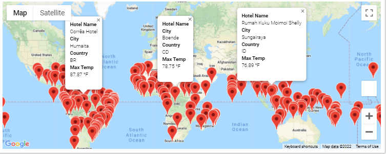

# World_Weather_Analysis

# Overview
In this project we are compiling data from Google Maps to try and see how we can make updates to a new app called PlanMyTrip. As we collect data we can try and improve the functions of the app to make it more user friendly. 

# Result

We collected data from 2000 different Lattitudes and Longitudes. With this information we can focusing on adding codes that will help us identify the how the weather is in each city that came up from our search. 

After runnign this code we came up with 691 cities that met our requirments. We exported this data into a csv file to help us continue improve our search for our vacation. 

Using the data from the csv file we created earlier we wanted to see how we can find the nearest cities and hotels based on our desired temperature. After creating the code we were able to narrow down our cities down to 162.  

We move the to final stage of our project and that to plan our trip and the cities we will be visting. First we created a code using Google Maps Directions to provide us with the directions to each city and the hotel that is avalibale. We are heading to Indonesia for our vacation

In this map we created a code to give us the full description od the hotel name, city, country and the current weather. 

# Summary
With the information we have created using Google Maps Api and Google Maps Directions Api we can help imporve the PlanMyTrip app by giving the users more options to choose from when it comes to finding their next vacation spot. 